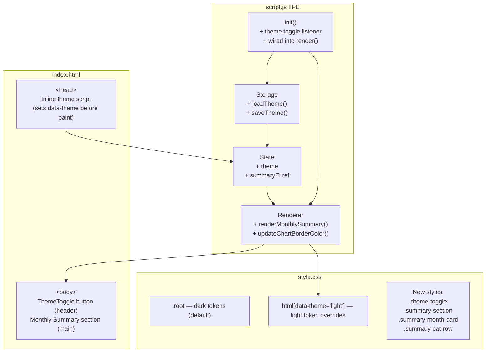
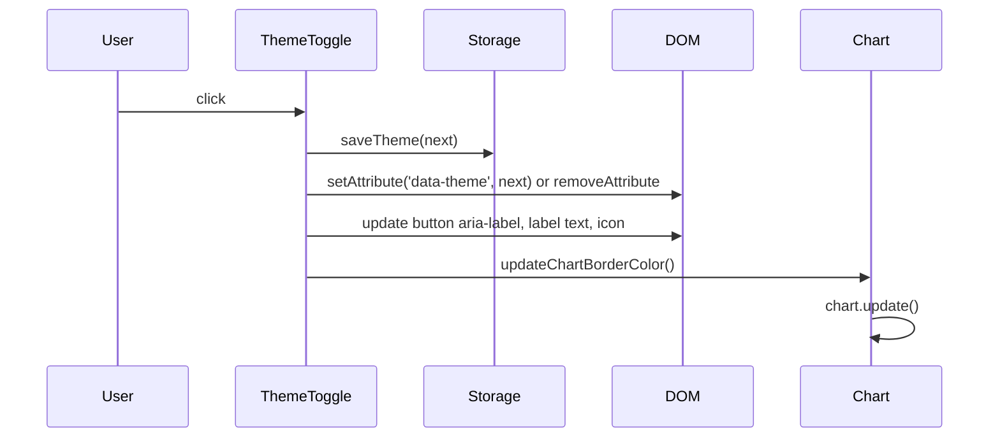
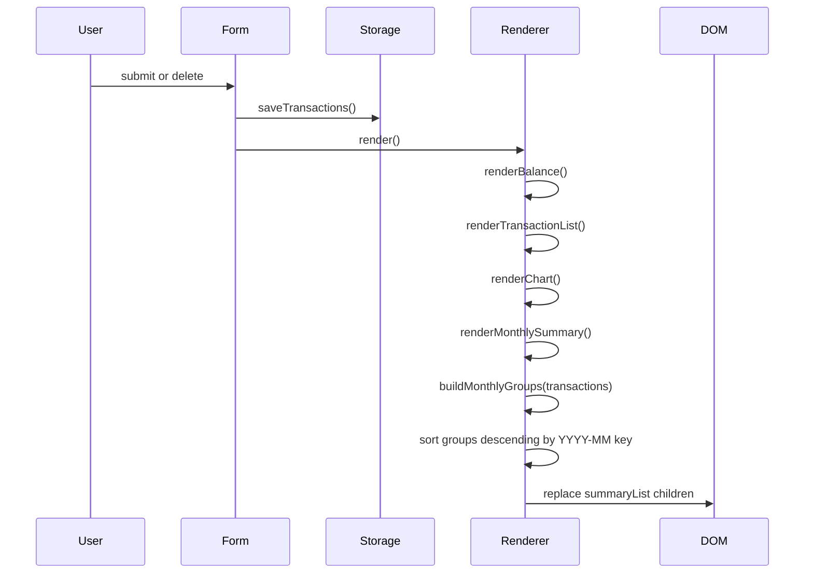

# Design Document: Expense Budget Visualizer — Requirements 9 & 10

## Overview

This document covers the technical design for the two remaining features of **Ledger**: the Monthly Summary View (Requirement 9) and the Dark/Light Mode Toggle (Requirement 10). Both features integrate into the existing vanilla-JS single-file IIFE architecture in `js/script.js` without introducing a build step, module system, or additional dependencies.

The existing app already establishes strong conventions — CSS custom properties for theming, a `render()` orchestrator that calls focused `renderX()` helpers, inline Storage functions, and Chart.js for visualization. The new features extend each of those layers in a consistent, additive way.

---

## Architecture

### Integration Strategy

The app is a single IIFE in `js/script.js`. Both new features are added **inside that same IIFE**, following the existing section pattern:

```
State variables          ← add: theme, refs to new DOM nodes
Storage functions        ← add: loadTheme(), saveTheme()
Renderer functions       ← add: renderMonthlySummary(), updateChartBorderColor()
Event wiring (init)      ← add: theme toggle listener
```

No new files are required. The chart instance (`let chart`) already lives in module scope, so `updateChartBorderColor()` can access it directly.

### Flash-of-Wrong-Theme Prevention

Theme must be applied **before** the stylesheet paints. This is handled by a tiny inline `<script>` in `<head>` — before `<link rel="stylesheet">` — that reads `ledger.theme` from LocalStorage and sets `data-theme` on `<html>` synchronously. The IIFE in `script.js` then reads the same value into its `theme` state variable at load time.


### Architecture Diagram



---

## HTML Changes

### 1. Inline Theme Script (in `<head>`, before stylesheet link)

This script must appear as the **very first child of `<head>`**, before any `<link>` or other tags, to guarantee synchronous application before any CSS is parsed.

```html
<script>
  (function() {
    var t = localStorage.getItem('ledger.theme');
    if (t === 'light') document.documentElement.setAttribute('data-theme', 'light');
  })();
</script>
```

### 2. ThemeToggle Button (in `<header class="app-header">`)

Place the toggle inside the existing `.app-header`, floated right via flexbox. Use a `<button>` with a visible label and an `aria-label` that reflects the *next* state the button will switch to.

```html
<header class="app-header">
  <div class="header-row">
    <div>
      <p class="eyebrow">Daily ledger</p>
      <h1>Expense &amp; Budget Visualizer</h1>
    </div>
    <button class="theme-toggle" id="themeToggle" aria-label="Switch to light mode">
      <span class="theme-toggle-icon" aria-hidden="true">☀</span>
      <span class="theme-toggle-label">Light</span>
    </button>
  </div>
</header>
```

### 3. Monthly Summary Section (after `<main class="grid">`, before `<footer>`)

```html
<section class="summary-section" aria-label="Monthly spending summary">
  <h2>Monthly Summary</h2>
  <div class="summary-list" id="summaryList">
    <p class="empty-state" id="summaryEmpty">No transactions yet.</p>
  </div>
</section>
```


---

## CSS Changes

### 1. Light Theme Token Overrides

The light theme overrides the same custom property names that all existing rules already consume. No existing selectors need to change.

```css
html[data-theme="light"] {
  --bg:         #F5F4F0;
  --surface:    #FFFFFF;
  --surface-2:  #EEEDE9;
  --border:     #D4D0C8;
  --text:       #1A1A1A;
  --text-muted: #5A5A6A;
}

html[data-theme="light"] body {
  background-image:
    radial-gradient(circle at 15% 0%, rgba(78,140,255,0.05), transparent 40%),
    radial-gradient(circle at 85% 20%, rgba(52,201,142,0.04), transparent 45%);
}
```

**WCAG AA compliance notes:**
- `--text` `#1A1A1A` on `--bg` `#F5F4F0` → contrast ~18:1 ✓
- `--text` on `--surface` `#FFFFFF` → contrast ~19.5:1 ✓
- `--text-muted` `#5A5A6A` on `--bg` → contrast ~5.6:1 ✓
- `--text-muted` on `--surface-2` `#EEEDE9` → contrast ~4.7:1 ✓ (meets 4.5:1 threshold)

### 2. ThemeToggle Button Styles

```css
.header-row {
  display: flex;
  justify-content: space-between;
  align-items: flex-start;
  gap: 12px;
}

.theme-toggle {
  display: flex;
  align-items: center;
  gap: 6px;
  background: var(--surface-2);
  border: 1px solid var(--border);
  border-radius: 999px;
  padding: 7px 14px;
  color: var(--text);
  font-family: var(--font-body);
  font-size: 13px;
  font-weight: 500;
  cursor: pointer;
  transition: background 0.15s ease, border-color 0.15s ease;
  flex-shrink: 0;
}
.theme-toggle:hover { background: var(--border); }
.theme-toggle:focus-visible {
  outline: 2px solid var(--transport);
  outline-offset: 2px;
}
.theme-toggle-icon { font-size: 15px; line-height: 1; }
```

### 3. Monthly Summary Section Styles

```css
.summary-section {
  margin-top: 28px;
  padding: 0 0 40px;
}
.summary-section h2 {
  font-family: var(--font-display);
  font-weight: 600;
  font-size: 16px;
  margin: 0 0 14px;
}
.summary-list {
  display: flex;
  flex-direction: column;
  gap: 14px;
}
.summary-month-card {
  background: var(--surface);
  border: 1px solid var(--border);
  border-radius: var(--radius);
  padding: 16px 20px;
}
.summary-month-header {
  display: flex;
  justify-content: space-between;
  align-items: baseline;
  margin-bottom: 10px;
}
.summary-month-label {
  font-family: var(--font-display);
  font-weight: 600;
  font-size: 14px;
}
.summary-month-total {
  font-family: var(--font-mono);
  font-weight: 700;
  font-size: 15px;
  color: var(--food);
}
.summary-cat-list {
  list-style: none;
  margin: 0;
  padding: 0;
  display: flex;
  flex-direction: column;
  gap: 6px;
}
.summary-cat-row {
  display: flex;
  justify-content: space-between;
  align-items: center;
  font-size: 13px;
}
.summary-cat-name {
  display: flex;
  align-items: center;
  gap: 8px;
  color: var(--text-muted);
}
.summary-cat-name .swatch {
  display: inline-block;
  width: 8px;
  height: 8px;
  border-radius: 2px;
  flex-shrink: 0;
}
.summary-cat-amount {
  font-family: var(--font-mono);
  font-size: 13px;
  color: var(--text-muted);
}
```


---

## JavaScript Changes

### 1. New State Variables

Add these inside the IIFE, alongside the existing `let transactions`, `let chart`, etc.:

```javascript
const THEME_KEY = 'ledger.theme';
let theme = loadTheme();   // 'dark' | 'light'
```

Add DOM ref for the new elements (in the DOM refs block):

```javascript
const themeToggleBtn = document.getElementById('themeToggle');
const summaryListEl  = document.getElementById('summaryList');
const summaryEmptyEl = document.getElementById('summaryEmpty');
```

### 2. New Storage Functions

```javascript
function loadTheme() {
  return localStorage.getItem(THEME_KEY) === 'light' ? 'light' : 'dark';
}

function saveTheme(value) {
  localStorage.setItem(THEME_KEY, value);
}
```

### 3. Theme Application Function

```javascript
function applyTheme(value) {
  theme = value;
  if (value === 'light') {
    document.documentElement.setAttribute('data-theme', 'light');
    themeToggleBtn.setAttribute('aria-label', 'Switch to dark mode');
    themeToggleBtn.querySelector('.theme-toggle-label').textContent = 'Dark';
    themeToggleBtn.querySelector('.theme-toggle-icon').textContent = '🌙';
  } else {
    document.documentElement.removeAttribute('data-theme');
    themeToggleBtn.setAttribute('aria-label', 'Switch to light mode');
    themeToggleBtn.querySelector('.theme-toggle-label').textContent = 'Light';
    themeToggleBtn.querySelector('.theme-toggle-icon').textContent = '☀';
  }
  updateChartBorderColor();
}
```

### 4. Chart Border Color Update

```javascript
function updateChartBorderColor() {
  if (!chart) return;
  // Surface background color per theme — matches CSS token values exactly
  const borderColor = theme === 'light' ? '#FFFFFF' : '#172230';
  chart.data.datasets[0].borderColor = borderColor;
  chart.update();
}
```

### 5. Monthly Summary Renderer

```javascript
function renderMonthlySummary() {
  summaryListEl.innerHTML = '';

  if (transactions.length === 0) {
    summaryListEl.appendChild(summaryEmptyEl);
    return;
  }

  const grouped = buildMonthlyGroups(transactions);
  // grouped is sorted descending by key (YYYY-MM)
  grouped.forEach(({ label, total, categories }) => {
    const card = document.createElement('div');
    card.className = 'summary-month-card';

    const catRows = Object.entries(categories)
      .sort((a, b) => b[1] - a[1])
      .map(([cat, amt]) => `
        <li class="summary-cat-row">
          <span class="summary-cat-name">
            <span class="swatch" style="background:${colorFor(cat)}"></span>
            ${escapeHtml(cat)}
          </span>
          <span class="summary-cat-amount">${formatMoney(amt)}</span>
        </li>
      `).join('');

    card.innerHTML = `
      <div class="summary-month-header">
        <span class="summary-month-label">${escapeHtml(label)}</span>
        <span class="summary-month-total">${formatMoney(total)}</span>
      </div>
      <ul class="summary-cat-list">${catRows}</ul>
    `;
    summaryListEl.appendChild(card);
  });
}
```

### 6. Monthly Grouping Logic (Data Model Helper)

```javascript
function buildMonthlyGroups(txList) {
  const map = {};  // key: 'YYYY-MM' → { label, total, categories: { catName: amount } }

  txList.forEach(t => {
    const d = new Date(t.createdAt);
    const key = `${d.getFullYear()}-${String(d.getMonth() + 1).padStart(2, '0')}`;
    const label = d.toLocaleDateString(undefined, { month: 'short', year: 'numeric' });

    if (!map[key]) {
      map[key] = { key, label, total: 0, categories: {} };
    }
    map[key].total += t.amount;
    map[key].categories[t.category] = (map[key].categories[t.category] || 0) + t.amount;
  });

  // Sort keys descending (most recent month first)
  return Object.values(map).sort((a, b) => b.key.localeCompare(a.key));
}
```

### 7. Updated `render()` Orchestrator

Add `renderMonthlySummary()` to the existing `render()` call:

```javascript
function render() {
  renderBalance();
  renderTransactionList();
  renderChart();
  renderMonthlySummary();   // ← new
}
```

### 8. Event Wiring in `init()`

```javascript
// Apply stored theme on init (DOM is ready; inline <head> script handled pre-paint)
applyTheme(theme);

// Theme toggle
themeToggleBtn.addEventListener('click', () => {
  const next = theme === 'dark' ? 'light' : 'dark';
  saveTheme(next);
  applyTheme(next);
});
```


---

## Data Models

### MonthlyGroup Shape

`buildMonthlyGroups()` returns an array of objects with the following shape:

```javascript
{
  key:        string,   // 'YYYY-MM', e.g. '2026-07' — used only for sorting
  label:      string,   // 'Jul 2026' — locale-formatted display string
  total:      number,   // sum of all transaction amounts in this month (≥ 0)
  categories: {
    [categoryName: string]: number  // per-category subtotal (> 0)
  }
}
```

**Grouping Key**: `YYYY-MM` derived from `new Date(transaction.createdAt)`, using the user's local time zone (consistent with the rest of the app which uses `Date` without timezone manipulation).

**Sort Order**: The returned array is sorted by `key` descending using `String.localeCompare`, so `'2026-07'` comes before `'2026-06'`.

**Invariants**:
- Every Transaction maps to exactly one MonthlyGroup.
- `group.total === Object.values(group.categories).reduce((s, v) => s + v, 0)` for all groups.
- No group has `total === 0` (groups only exist because at least one transaction belongs to them).
- The `categories` map has no zero-value entries.

---

## Components and Interfaces

### Monthly Summary Card

Each `summary-month-card` renders as a rounded surface card that matches the existing `.card` visual language but sits in the full-width section below the two-column grid.

```
┌──────────────────────────────────────────────┐
│  Jul 2026                          $342.50   │
│  ────────────────────────────────────────    │
│  ● Food                            $180.00   │
│  ● Transport                        $92.50   │
│  ● Fun                              $70.00   │
└──────────────────────────────────────────────┘
```

- Month label: `font-display`, semibold, 14px
- Month total: `font-mono`, bold, 15px, colored `var(--food)` (green accent, consistent with the balance tape)
- Category rows: sorted by amount descending within each month card
- Color swatch: 8×8 px square using same `colorFor(cat)` as chart legend, ensuring visual consistency

### ThemeToggle Button

Pill-shaped toggle button placed in the top-right of the header row:

```
Dark mode:  [ ☀  Light ]
Light mode: [ 🌙 Dark  ]
```

- The label reflects **what the button will switch to** (not the current state), matching common toggle conventions
- `aria-label` mirrors the label text for screen reader users: "Switch to light mode" / "Switch to dark mode"
- Icon and label update together inside `applyTheme()`
- Uses existing `var(--surface-2)` and `var(--border)` tokens so it adapts to both themes automatically

### Theme Transition

No CSS `transition` on token-consuming properties by default (the existing `@media (prefers-reduced-motion)` block already suppresses all transitions). For the standard case, a brief opacity or background transition can be added:

```css
html { color-scheme: dark; }
html[data-theme="light"] { color-scheme: light; }

body {
  transition: background-color 0.2s ease, color 0.2s ease;
}
```

This keeps the switch feel smooth without affecting users who prefer reduced motion.


---

## Sequence Diagrams

### Theme Toggle Flow



### Page Load (Flash Prevention)

```mermaid
sequenceDiagram
    participant Browser
    participant InlineScript as Inline &lt;script&gt; in &lt;head&gt;
    participant CSS
    participant IIFE as script.js IIFE

    Browser->>InlineScript: execute synchronously
    InlineScript->>Browser: localStorage.getItem('ledger.theme')
    InlineScript->>Browser: document.documentElement.setAttribute('data-theme', 'light') [if saved]
    Browser->>CSS: parse stylesheet (data-theme already set)
    CSS->>Browser: apply correct tokens from first paint
    Browser->>IIFE: execute
    IIFE->>IIFE: loadTheme() → theme = 'light' | 'dark'
    IIFE->>IIFE: init() → applyTheme(theme) → sync button UI state
```

### Monthly Summary Update Flow




---

## Correctness Properties

These properties describe universal invariants the implementation must satisfy. They are designed to be verified with a property-based testing library (e.g., fast-check).

### Property 1: Monthly Group Totals Are Exact Sums

**Validates: Requirements 9.2, 9.3**

For any non-empty array of transactions, the `total` of every MonthlyGroup returned by `buildMonthlyGroups` must equal the sum of all transaction amounts whose `createdAt` falls in that group's calendar month.

```
∀ txList: Transaction[],
  ∀ group ∈ buildMonthlyGroups(txList):
    group.total === txList
      .filter(t => monthKey(t.createdAt) === group.key)
      .reduce((s, t) => s + t.amount, 0)
```

### Property 2: Monthly Group Category Subtotals Sum to Group Total

**Validates: Requirements 9.4**

For any MonthlyGroup, the sum of all per-category amounts equals the group's total.

```
∀ group ∈ buildMonthlyGroups(txList):
  group.total === Object.values(group.categories).reduce((s, v) => s + v, 0)
```

### Property 3: Every Transaction Belongs to Exactly One Group

**Validates: Requirements 9.2, 9.3**

For any transaction list, every transaction is counted in exactly one group's total — no transaction is double-counted or omitted.

```
∀ txList: Transaction[],
  let groups = buildMonthlyGroups(txList)
  groups.reduce((s, g) => s + g.total, 0) === txList.reduce((s, t) => s + t.amount, 0)
```

### Property 4: Groups Are Sorted Descending by Month Key

**Validates: Requirements 9.7**

The array returned by `buildMonthlyGroups` must be in strictly non-ascending order of `YYYY-MM` keys.

```
∀ txList: Transaction[] with txList.length > 0,
  let groups = buildMonthlyGroups(txList)
  ∀ i ∈ [0, groups.length - 2]:
    groups[i].key >= groups[i + 1].key
```

### Property 5: No Empty Groups

**Validates: Requirements 9.2, 9.5**

`buildMonthlyGroups` never produces a group with total zero or with an empty categories map.

```
∀ group ∈ buildMonthlyGroups(txList):
  group.total > 0 ∧ Object.keys(group.categories).length > 0
```

### Property 6: Group Count Equals Distinct Month Count

**Validates: Requirements 9.2**

The number of groups returned equals the number of distinct `YYYY-MM` values in the transaction list.

```
∀ txList: Transaction[],
  buildMonthlyGroups(txList).length ===
    new Set(txList.map(t => monthKey(t.createdAt))).size
```

### Property 7: Theme Toggle Is a Strict Involution

**Validates: Requirements 10.2**

Applying `applyTheme` twice with toggled values returns to the original DOM state. After one toggle, `data-theme` reflects the new theme; after a second toggle, it reflects the original.

```
∀ initial ∈ { 'dark', 'light' }:
  applyTheme(initial)
  let state1 = document.documentElement.getAttribute('data-theme')
  applyTheme(initial === 'dark' ? 'light' : 'dark')
  applyTheme(initial)
  let state2 = document.documentElement.getAttribute('data-theme')
  state1 === state2
```

### Property 8: Theme Persisted Equals Theme Applied on Load

**Validates: Requirements 10.5, 10.6, 10.7**

After calling `saveTheme(value)`, calling `loadTheme()` returns the same value — and `applyTheme(loadTheme())` sets `data-theme` (or absence thereof) consistently.

```
∀ value ∈ { 'dark', 'light' }:
  saveTheme(value)
  loadTheme() === value
```

### Property 9: Chart Border Color Matches Active Surface Token

**Validates: Requirements 10.9**

After any call to `applyTheme`, if a Chart instance exists, the dataset's `borderColor` equals the CSS custom property value for `--surface` in the currently active theme.

```
∀ theme ∈ { 'dark', 'light' }:
  applyTheme(theme)
  chart.data.datasets[0].borderColor ===
    (theme === 'light' ? '#FFFFFF' : '#172230')
```

### Property 10: Add/Delete Cycle Leaves Summary Consistent

**Validates: Requirements 9.6**

For any sequence of add and delete operations on a transaction list, `renderMonthlySummary` produces the same DOM output as calling it on the final state of the list — order of operations does not affect the result.

```
∀ txList: Transaction[], ∀ deletedId: string ∈ txList.map(t => t.id):
  let finalList = txList.filter(t => t.id !== deletedId)
  buildMonthlyGroups(finalList) deep-equals buildMonthlyGroups(txList after delete of deletedId)
```

### Property 11: No Category Entry Has Zero Amount

**Validates: Requirements 9.4**

For any group in the result of `buildMonthlyGroups`, no category subtotal is zero or negative.

```
∀ group ∈ buildMonthlyGroups(txList),
  ∀ [cat, amt] ∈ Object.entries(group.categories):
    amt > 0
```

---

## Testing Strategy

### Unit Testing Approach

Each new pure function — primarily `buildMonthlyGroups()` and `loadTheme()` — should be unit-tested in isolation by extracting them from the IIFE into a testable scope (or testing via a small harness that stubs `localStorage`).

Key unit test cases:
- `buildMonthlyGroups([])` returns `[]`
- Single transaction maps to one group with correct key, label, total, and categories entry
- Transactions across two calendar months produce two groups, sorted descending
- Multiple transactions in same month and category accumulate correctly in `categories` map
- `loadTheme()` returns `'dark'` when key is absent, `'light'` when key is `'light'`, `'dark'` for any other value

### Property-Based Testing Approach

The correctness properties P1–P11 above are the primary targets for property-based testing.

**Property Test Library**: fast-check

Recommended generators:
- `fc.array(transactionArbitrary, { minLength: 1, maxLength: 50 })` — varied transaction lists
- `transactionArbitrary`: `{ id, name, amount: fc.float({ min: 0.01, max: 999999 }), category, createdAt: fc.integer({ min: 0 }) }`
- `fc.constantFrom('dark', 'light')` — theme values

Priority properties for PBT:
- **P1** and **P2** (total consistency) — highest value, easily generates edge cases like many transactions in one month
- **P3** (no double-counting) — guards against off-by-one in grouping
- **P4** (sort order) — verifies comparator correctness across random month distributions
- **P6** (group count) — ensures no spurious empty groups or duplicates

### Integration Testing Approach

Manual browser tests covering:
1. Toggle theme → refresh page → confirm theme persists and no flash occurs
2. Add transactions across at least two calendar months → confirm summary cards appear in correct order
3. Delete all transactions in a month → confirm that month's card disappears from summary
4. Toggle theme with chart present → confirm chart border color updates

---

## Error Handling

### LocalStorage Unavailable or Quota Exceeded

`loadTheme()` reads a single string value — it cannot throw a JSON parse error, but `localStorage.getItem` can throw in private browsing on some browsers. Wrap in try/catch and default to `'dark'`:

```javascript
function loadTheme() {
  try {
    return localStorage.getItem(THEME_KEY) === 'light' ? 'light' : 'dark';
  } catch { return 'dark'; }
}

function saveTheme(value) {
  try { localStorage.setItem(THEME_KEY, value); } catch { /* silently ignore */ }
}
```

The same pattern already used by `loadTransactions()` and `loadCategories()` in the existing code.

### Chart Not Yet Initialized

`updateChartBorderColor()` guards against `chart === null` — this is the state on first load before any transactions exist. The guard `if (!chart) return;` prevents a null dereference.

---

## Dependencies

No new external dependencies are introduced. This design relies exclusively on:

- **Chart.js 4.4.4** (already loaded via CDN) — `chart.update()` is used by `updateChartBorderColor()`
- **CSS Custom Properties** (all modern browsers) — the entire theming mechanism
- **Web Storage API** (`localStorage`) — already in use for all persistence
- **`crypto.randomUUID()`** — already used for transaction IDs (no change needed)
